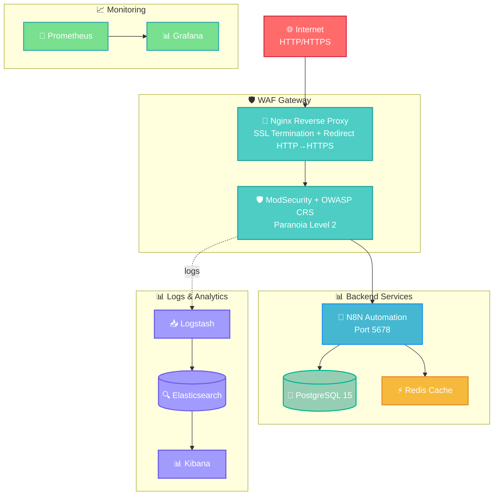

# Documentation WAF ModSecurity + OWASP CRS pour N8N & Stack de Monitoring

## 📋 Vue d'ensemble

Cette solution déploie :

* Un **Web Application Firewall (WAF)** basé sur ModSecurity et OWASP Core Rule Set (CRS) pour protéger une instance **N8N**.
* Une stack **ELK (Elasticsearch, Logstash, Kibana)** pour la collecte et l'analyse des logs.
* **Prometheus** et **Grafana** pour le monitoring des performances et métriques.
* Un cache **Redis** pour optimiser N8N.

Le WAF agit comme un proxy inverse avec terminaison SSL et filtrage avancé des requêtes.

## 🏗️ Architecture de la solution



## 🔧 Composants techniques

### 1. WAF Gateway (ModSecurity + Nginx)

* **Image** : `owasp/modsecurity-crs:nginx`
* **Ports** : 80 (HTTP) → 443 (HTTPS)
* **Fonctions** :

  * Terminaison SSL
  * Redirection automatique vers HTTPS
  * Filtrage OWASP CRS niveau 2
  * Audit logs détaillés

### 2. N8N

* **Image** : `n8nio/n8n:latest`
* **DB** : PostgreSQL 15
* **Cache** : Redis
* **Sécurité** : Authentification Basic activée

### 3. Stack ELK

* **Elasticsearch** : Indexation des logs
* **Logstash** : Ingestion et transformation
* **Kibana** : Visualisation

### 4. Monitoring

* **Prometheus** : Collecte métriques
* **Grafana** : Dashboards personnalisés

## ⚙️ Configuration

* **Variables d’environnement N8N** dans `.env`
* **Certificats SSL** dans `config/waf/certs`
* **Règles ModSecurity** dans `config/waf/modsecurity.d/owasp-crs/custom_rules`
* **Pipeline Logstash** dans `config/SIEM/logstash/pipeline`
* **Prometheus** dans `prometheus/prometheus.yml`
* **Grafana** dashboards & datasources dans `grafana/`

## 🚀 Déploiement

```bash
docker-compose up -d
docker-compose ps
```

Vérifier :

* WAF : `https://localhost` (redirection HTTP→HTTPS)
* Kibana : `http://localhost:5601`
* Grafana : `http://localhost:3000`
* Prometheus : `http://localhost:9090`

## 🧪 Tests rapides

* Injection SQL : `curl -k "https://localhost/?id=1' OR '1'='1"`
* XSS : `curl -k "https://localhost/?search=<script>alert(1)</script>"`

Les deux doivent être bloqués (HTTP 403).

## 📊 Logs

```bash
docker exec waf-gateway tail -f /var/log/modsecurity_audit.log
docker exec logstash tail -f /usr/share/logstash/logs/logstash-plain.log
```

## 🔒 Sécurité

Protège contre :

* SQLi, XSS, CSRF, Path Traversal
* Injection de commandes
* User-agents malveillants
* Méthodes HTTP non autorisées
