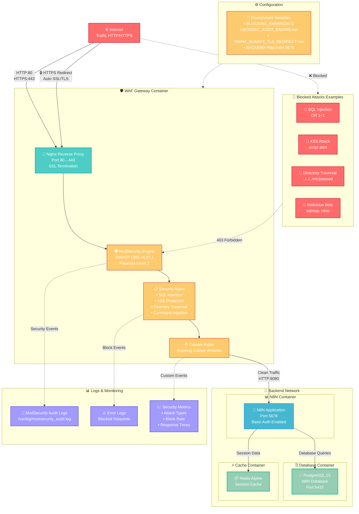

# Documentation WAF ModSecurity + OWASP CRS pour N8N

## 📋 Vue d'ensemble

Cette solution implémente un Web Application Firewall (WAF) basé sur ModSecurity et OWASP Core Rule Set (CRS) pour protéger une instance N8N. Le WAF agit comme un proxy inverse avec terminaison SSL et filtrage avancé des requêtes.

## 🏗️ Architecture de la solution



## 🔧 Composants techniques

### 1. WAF Gateway (ModSecurity + Nginx)
- **Image**: `owasp/modsecurity-crs:nginx`
- **Ports exposés**: 80 (HTTP) → 443 (HTTPS)
- **Fonctionnalités**:
    - Terminaison SSL/TLS
    - Redirection automatique HTTP → HTTPS
    - Filtrage des requêtes malveillantes
    - Logs d'audit détaillés

### 2. Backend N8N
- **Image**: `n8nio/n8n:latest`
- **Base de données**: PostgreSQL 15
- **Cache**: Redis Alpine
- **Authentification**: Basic Auth activée

## ⚙️ Configuration détaillée

### ModSecurity Configuration

#### Mode d'opération
```apache
SecRuleEngine On  # Mode protection actif
```

#### Paramètres OWASP CRS
- **Paranoia Level**: 2 (équilibre sécurité/faux positifs)
- **Mode**: Anomaly Scoring (recommandé)
- **Seuils par défaut**:
    - Critical: 5 points
    - Error: 4 points
    - Warning: 3 points
    - Notice: 2 points

#### Règles personnalisées
```apache
# Whitelist pour cookie PostHog (évite les faux positifs SQL injection)
SecRuleUpdateTargetByTag "attack-sqli" "!REQUEST_COOKIES:ph_phc_4URIAm1uYfJO7j8kWSe0J8lc8IqnstRLS7Jx8NcakHo_posthog"
```

### SSL/TLS Configuration
- **Certificats**: Auto-signés (développement)
- **Redirection forcée**: HTTP → HTTPS
- **Emplacement**: `/etc/nginx/certs/`

## 🚀 Installation et déploiement

### Prérequis
- Docker et Docker Compose installés
- Ports 80 et 443 disponibles
- Variables d'environnement configurées

### 1. Préparation des fichiers

```bash
# Structure des répertoires
mkdir -p config/waf/{certs,modsecurity.d/owasp-crs/custom_rules}

# Copie des certificats SSL
cp server.crt config/waf/certs/
cp server.key config/waf/certs/

# Configuration des règles personnalisées
echo 'SecRuleUpdateTargetByTag "attack-sqli" "!REQUEST_COOKIES:ph_phc_4URIAm1uYfJO7j8kWSe0J8lc8IqnstRLS7Jx8NcakHo_posthog"' > config/waf/modsecurity.d/owasp-crs/custom_rules/00-whitelist-cookies.conf
```

### 2. Configuration des variables d'environnement

Créer un fichier `.env` :
```bash
# Base de données N8N
N8N_POSTGRES_DB=n8n
N8N_POSTGRES_USER=n8n
N8N_POSTGRES_PASSWORD=your_secure_password

# Authentification N8N
N8N_BASIC_AUTH_USER=admin
N8N_BASIC_AUTH_PASSWORD=your_admin_password

# Configuration réseau
N8N_HOST=localhost
N8N_PORT=5678
```

### 3. Déploiement

```bash
# Lancement des services
docker-compose up -d

# Vérification du statut
docker-compose ps

# Consultation des logs WAF
docker-compose logs waf-gateway

# Logs ModSecurity
docker exec waf-gateway tail -f /var/log/modsecurity_audit.log
```

## 🧪 Tests et validation

### 1. Tests fonctionnels

```bash
# Test de redirection HTTP → HTTPS
curl -I http://localhost
# Doit retourner: Location: https://localhost

# Test d'accès HTTPS
curl -k https://localhost
# Doit afficher la page N8N

# Test avec authentification
curl -k -u admin:your_admin_password https://localhost
```

### 2. Tests de sécurité

```bash
# Test injection SQL basique
curl -k "https://localhost/?id=1' OR '1'='1"
# Doit être bloqué (403)

# Test XSS
curl -k "https://localhost/?search=<script>alert('xss')</script>"
# Doit être bloqué (403)

# Test traversal de répertoire
curl -k "https://localhost/../../../etc/passwd"
# Doit être bloqué (403)

# Test user-agent malveillant
curl -k -H "User-Agent: sqlmap/1.0" https://localhost
# Doit être bloqué (403)
```

### 3. Monitoring et logs

```bash
# Surveillance des logs en temps réel
docker exec waf-gateway tail -f /var/log/modsecurity_audit.log

# Analyse des alertes
docker exec waf-gateway grep "ModSecurity: Access denied" /var/log/modsecurity_audit.log

# Statistiques des règles déclenchées
docker exec waf-gateway grep -o "id \"[0-9]*\"" /var/log/modsecurity_audit.log | sort | uniq -c
```

## 📊 Justification des choix techniques

### 1. OWASP ModSecurity CRS
**Avantages** :
- Standard industriel reconnu
- Règles maintenues par la communauté OWASP
- Couverture large des attaques (OWASP Top 10)
- Faux positifs réduits avec Paranoia Level 2

**Alternative considérée** : AWS WAF, Cloudflare WAF
**Justification** : Solution open-source, contrôle total, pas de dépendance cloud

### 2. Nginx comme reverse proxy
**Avantages** :
- Performance élevée
- Gestion native SSL/TLS
- Intégration native avec ModSecurity v3
- Faible consommation mémoire

**Alternative considérée** : Apache HTTP Server
**Justification** : Meilleure performance, plus adapté aux conteneurs

### 3. Mode Anomaly Scoring
**Avantages** :
- Logs détaillés pour le tuning
- Flexibilité dans les seuils de blocage
- Réduction des faux positifs

**Alternative considérée** : Mode Self-Contained
**Justification** : Permet un tuning fin et une montée en charge progressive

### 4. Paranoia Level 2
**Avantages** :
- Équilibre optimal sécurité/usabilité
- Couverture étendue sans trop de faux positifs
- Recommandé pour les environnements de production

**Alternative considérée** : PL1 (trop permissif) ou PL3/4 (trop restrictif)
**Justification** : Optimal pour une application métier comme N8N

## 🔒 Fonctionnalités de sécurité implémentées

### Protection contre :
- ✅ Injection SQL
- ✅ Cross-Site Scripting (XSS)
- ✅ Cross-Site Request Forgery (CSRF)
- ✅ Traversal de répertoires
- ✅ Injection de commandes OS
- ✅ Inclusion de fichiers distants (RFI/LFI)
- ✅ Attaques par déni de service (DoS)
- ✅ Scanning automatisé
- ✅ User-Agents malveillants

### Contrôles de protocole :
- ✅ Validation des méthodes HTTP
- ✅ Validation des en-têtes
- ✅ Contrôle des types de contenu
- ✅ Limitation de la taille des requêtes
- ✅ Validation des versions HTTP

## 🚨 Monitoring et maintenance

### Indicateurs clés (KPI)
- Nombre de requêtes bloquées/heure
- Types d'attaques les plus fréquentes
- Taux de faux positifs
- Performance (latence ajoutée)

### Maintenance recommandée
- **Quotidienne** : Vérification des logs d'alertes
- **Hebdomadaire** : Analyse des tendances d'attaque
- **Mensuelle** : Mise à jour des règles CRS
- **Trimestrielle** : Révision des règles personnalisées

### Procédure de mise à jour
```bash
# Sauvegarde de la configuration
docker exec waf-gateway cp -r /etc/modsecurity.d /backup/

# Mise à jour de l'image
docker-compose pull waf-gateway
docker-compose up -d waf-gateway

# Vérification post-mise à jour
docker-compose logs waf-gateway
```

## 🎯 Améliorations possibles

### Court terme
- Intégration avec un SIEM (ELK Stack, Splunk)
- Alertes automatiques (email, Slack)
- Dashboard de monitoring (Grafana)

### Moyen terme
- Géolocalisation et blocage par pays
- Machine Learning pour la détection d'anomalies
- Intégration avec des feeds de threat intelligence

### Long terme
- Clustering multi-instances
- Load balancing avec failover
- Intégration CI/CD pour les règles personnalisées
